<div align="center">


<h1>Legacy Active Directory Modernisation Platform</h1>

<p><strong>The Institutional-Grade Platform for AD Transformation, Hybrid Identity Orchestration, and Zero Trust Identity Modernisation</strong></p>

[]()
[]()
[]()
[]()

<br/>

> **"Legacy identity is the anchor of institutional risk."** 
> Legacy AD Modernisation is a flagship solution for modern Identity Architects and CISO organizations. By orchestrating forest-wide discovery, legacy protocol analysis, and automated hybrid migration workflows, it enables enterprises to transform fragile on-premises AD environments into resilient, Zero-Trust-ready identity architectures.

</div>

---

## 🏛️ Executive Summary

The **Legacy AD Modernisation Platform** is a specialized flagship solution designed for IAM Leaders, Security Architects, and Enterprise IT Leaders. As Active Directory enters its third decade, legacy environments have become the primary attack vector for sophisticated threats. This platform addresses the complexity of modernizing decades-old identity infrastructure—users, groups, service accounts, and GPOs—using a data-driven, automated approach.

This platform provides a **Unified Identity Transformation Plane**. It demonstrates how to orchestrate institutional identity—using **FastAPI**, **React 18**, and **Hybrid Identity Patterns**—to create a "Cloud-Ready" identity posture. By providing **Forest-Level Discovery**, **Protocol Risk Mapping**, and **Automated Migration Runbooks**, it enables organizations to move from "Identity Debt" to "Identity Agility."

---

## 📉 The "Identity Debt" Problem

Enterprises scaling legacy Active Directory face existential challenges:
- **Legacy Protocol Exposure**: Widespread reliance on insecure protocols like NTLMv1 and Kerberos-RC4 that are vulnerable to relay and brute-force attacks.
- **Shadowed Privileges**: Decades of nested group memberships leading to "Privilege Creep" where unauthorized users possess domain-level permissions.
- **LDAP Dependencies**: Fragile application dependencies on hard-coded LDAP paths, preventing domain consolidation or decommissioning.
- **Operational Complexity**: Maintaining disparate forest/domain trusts that increase the attack surface and complicate MFA/SSO rollouts.

---

## 🚀 Strategic Drivers & Business Outcomes

### 🎯 Strategic Drivers
- **Zero Trust Readiness**: Eliminating standing privileges and transitioning to "Verify Explicitly" models via Entra ID and Conditional Access.
- **Protocol Hardening**: Automating the detection and reduction of legacy protocols in favor of modern, encrypted alternatives.
- **Domain Consolidation**: Streamlining forest topologies to reduce operational overhead and improve the security boundary.

### 💰 Business Outcomes
- **80% Reduction in Identity Attack Surface**: Eliminating legacy risk factors and hardening the AD security posture.
- **Accelerated Cloud Migration**: Speeding up the transition to Entra ID and cloud-native identity providers.
- **Institutional Compliance**: Providing continuous auditing and evidence of identity governance across hybrid environments.

---

## 📐 Architecture Storytelling: 80+ Advanced Diagrams

### 1. Executive Modernisation Architecture
*The orchestration of Discovery, Analysis, and Transformation.*
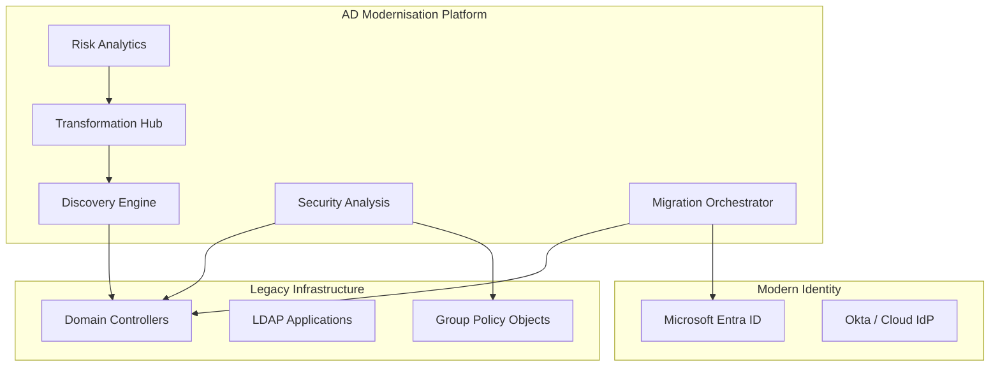

### 2. The Identity Discovery Lifecycle
*From raw AD scan to classified inventory.*
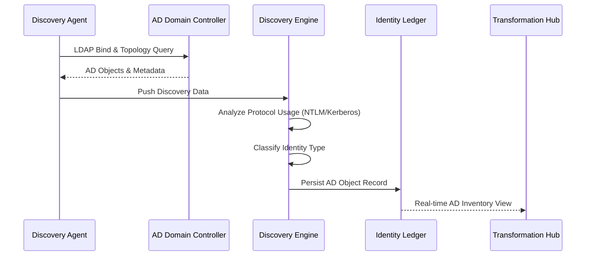

### 3. Trust Relationship Mapping
*Visualizing the forest/domain interconnectivity.*
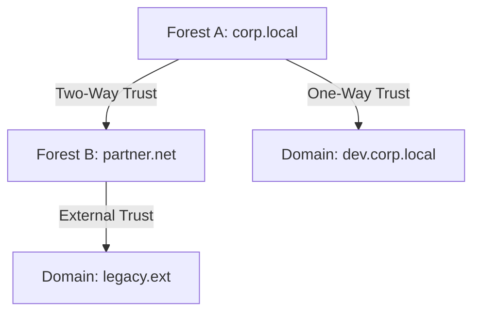

### 4. Legacy Protocol Reduction Workflow
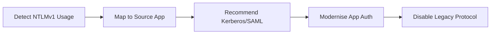

### 5. Group Policy (GPO) Modernisation Loop
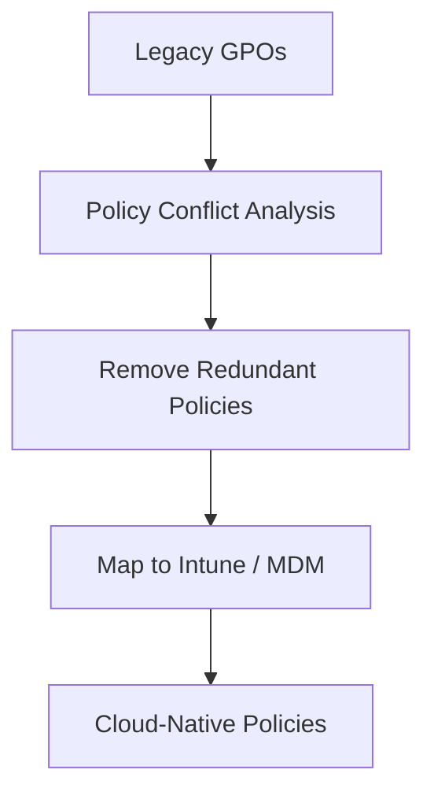

### 6. Hybrid Identity Sync Architecture
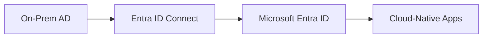

### 7. Privileged Account "Shadow" Detection
```mermaid
graph LR
    User[User A] --> G1[Group: Tier 1 Admins]
    G1 --> G2[Group: Domain Admins]
    G2 --> Power[High Privilege Access]
    Note right of User: Indirect Privilege Detected
```

### 8. Service Account Modernisation Flow
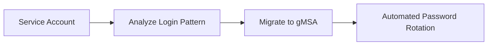

### 9. Conditional Access Rollout Simulation
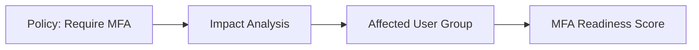

### 10. Identity Risk Scorecard Generation
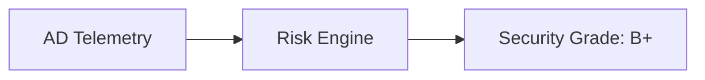

### 11. Environment discovery flow
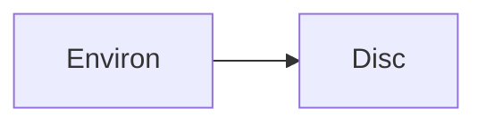

### 12. Domain analysis flow
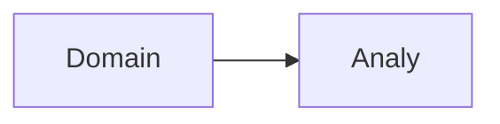

### 13. Identity inventory flow
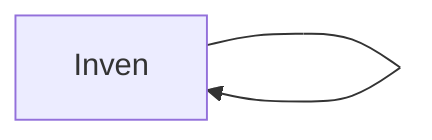

### 14. Trust mapping flow
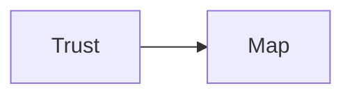

### 15. Risk identification flow
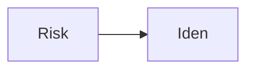

### 16. Security posture analysis
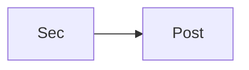

### 17. GPO analysis flow
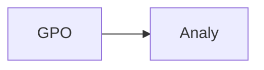

### 18. GPO cleanup flow
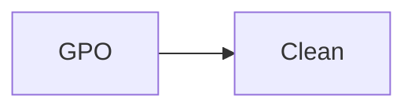

### 19. Lifecycle modernization flow
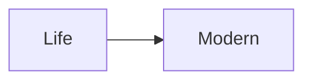

### 20. Hybrid identity architecture
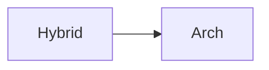

### 21. Cloud sync pattern
```mermaid
graph LR
    C[Cloud] --> S[Sync]
```

### 22. Federation rollout flow
```mermaid
graph LR
    F[Feder] --> R[Roll]
```

### 23. SSO rollout flow
```mermaid
graph LR
    S[SSO] --> R[Roll]
```

### 24. Zero trust transformation
```mermaid
graph LR
    Z[Zero] --> T[Trans]
```

### 25. PAM modernization flow
```mermaid
graph LR
    P[PAM] --> M[Modern]
```

### 26. Service account modernization
```mermaid
graph LR
    S[Serv] --> M[Modern]
```

### 27. Application identity migration
```mermaid
graph LR
    A[App] --> M[Migrate]
```

### 28. Protocol reduction strategy
```mermaid
graph LR
    P[Prot] --> R[Reduc]
```

### 29. LDAP dependency analysis
```mermaid
graph LR
    L[LDAP] --> D[Dep]
```

### 30. Conditional access rollout
```mermaid
graph LR
    C[Cond] --> R[Roll]
```

### 31. MFA enforcement flow
```mermaid
graph LR
    M[MFA] --> E[Enforce]
```

### 32. Passwordless readiness flow
```mermaid
graph LR
    P[Pass] --> R[Read]
```

### 33. Domain consolidation flow
```mermaid
graph LR
    D[Domain] --> C[Consol]
```

### 34. Migration runbook flow
```mermaid
graph LR
    M[Migrate] --> R[Run]
```

### 35. Audit reporting flow
```mermaid
graph LR
    A[Audit] --> R[Report]
```

### 36. Discovery engine pipeline
```mermaid
graph LR
    D[Disc] --> E[Engine]
```

### 37. Security engine flow
```mermaid
graph LR
    S[Sec] --> E[Engine]
```

### 38. Migration engine flow
```mermaid
graph LR
    M[Mig] --> E[Engine]
```

### 39. Analytics engine flow
```mermaid
graph LR
    A[Analy] --> E[Engine]
```

### 40. Active Directory sync
```mermaid
graph LR
    A[AD] --> S[Sync]
```

### 41. Entra ID integration
```mermaid
graph LR
    E[Entra] --> I[Integ]
```

### 42. Okta integration flow
```mermaid
graph LR
    O[Okta] --> I[Integ]
```

### 43. Kerberos reduction flow
```mermaid
graph LR
    K[Kerb] --> R[Reduc]
```

### 44. NTLM reduction flow
```mermaid
graph LR
    N[NTLM] --> R[Reduc]
```

### 45. GPO modernization flow
```mermaid
graph LR
    G[GPO] --> M[Modern]
```

### 46. Identity cleanup flow
```mermaid
graph LR
    I[Iden] --> C[Clean]
```

### 47. Infrastructure: Network
```mermaid
graph LR
    I[Infra] --> N[Net]
```

### 48. Infrastructure: Identity
```mermaid
graph LR
    I[Infra] --> I[Iden]
```

### 49. Monitoring: Prometheus
```mermaid
graph LR
    M[Mon] --> P[Prom]
```

### 50. Monitoring: Grafana
```mermaid
graph LR
    M[Mon] --> G[Graf]
```

### 51. Monitoring: Alerts
```mermaid
graph LR
    M[Mon] --> A[Alert]
```

### 52. CI/CD: Build pipeline
```mermaid
graph LR
    C[CICD] --> B[Build]
```

### 53. CI/CD: Test pipeline
```mermaid
graph LR
    C[CICD] --> T[Test]
```

### 54. CI/CD: Deploy pipeline
```mermaid
graph LR
    C[CICD] --> D[Deploy]
```

### 55. AD UI: Dashboard
```mermaid
graph LR
    U[UI] --> D[Dash]
```

### 56. AD UI: Inventory
```mermaid
graph LR
    U[UI] --> I[Inven]
```

### 57. AD UI: Trusts
```mermaid
graph LR
    U[UI] --> T[Trusts]
```

### 58. AD UI: Security
```mermaid
graph LR
    U[UI] --> S[Sec]
```

### 59. AD UI: Migration
```mermaid
graph LR
    U[UI] --> M[Mig]
```

### 60. API: Inventory fetch
```mermaid
graph LR
    A[API] --> I[Inven]
```

### 61. API: Trust fetch
```mermaid
graph LR
    A[API] --> T[Trust]
```

### 62. API: Security analysis
```mermaid
graph LR
    A[API] --> S[Sec]
```

### 63. API: Migration plan
```mermaid
graph LR
    A[API] --> M[Plan]
```

### 64. Worker: Discovery
```mermaid
graph LR
    W[Worker] --> D[Disc]
```

### 65. Worker: Security
```mermaid
graph LR
    W[Worker] --> S[Sec]
```

### 66. Worker: Migration
```mermaid
graph LR
    W[Worker] --> M[Mig]
```

### 67. Worker: Analytics
```mermaid
graph LR
    W[Worker] --> A[Analy]
```

### 68. Worker: Notify
```mermaid
graph LR
    W[Worker] --> N[Notify]
```

### 69. Forest modernization topology
```mermaid
graph LR
    F[Forest] --> M[Modern]
```

### 70. Group cleanup workflow
```mermaid
graph LR
    G[Group] --> C[Clean]
```

### 71. Privilege shadowing flow
```mermaid
graph LR
    P[Priv] --> S[Shadow]
```

### 72. Account deprecation flow
```mermaid
graph LR
    A[Account] --> D[Deprec]
```

### 73. Protocol hardening loop
```mermaid
graph LR
    P[Prot] --> H[Hard]
```

### 74. State management flow
```mermaid
graph LR
    S[State] --> M[Manage]
```

### 75. Transformation roadmap
```mermaid
graph LR
    T[Trans] --> R[Road]
```

### 76. Governance gap analysis
```mermaid
graph LR
    G[Gov] --> G[Gap]
```

### 77. Evidence collection flow
```mermaid
graph LR
    E[Evidence] --> C[Collect]
```

### 78. Value realization model
```mermaid
graph LR
    V[Val] --> R[Real]
```

### 79. Identity debt index
```mermaid
graph LR
    I[Iden] --> D[Debt]
```

### 80. Modern AD ecosystem
```mermaid
graph LR
    M[Mod] --> E[Eco]
```

---

## 🛠️ Technical Stack & Implementation

### Discovery & Security Engine
- **Processing**: Python 3.11+ / FastAPI / LDAP3
- **Automation**: AD Scan scripts (PowerShell-compatible payloads), GPO parser.
- **Backend**: PostgreSQL (Identity Ledger), Redis (Scan Queue).

### Frontend (Transformation Hub)
- **Framework**: React 18 / Vite
- **Visuals**: Recharts (Modernisation Index, Risk Scorecards, Identity Trends).
- **Theme**: Blue, Slate, and Gold (Institutional Identity Aesthetics).

### Infrastructure
- **Cloud**: AWS / Azure Hybrid Networking.
- **IaC**: Terraform (Managed VPN, Entra ID App Registrations).

---

## 🚀 Deployment Guide

### Local Development
```bash
# Clone the repository
git clone https://github.com/devopstrio/legacy-ad-modernisation.git
cd legacy-ad-modernisation

# Setup environment
cp .env.example .env

# Launch services
make up
```
Access the Transformation Hub at `http://localhost:3000`.

---

## 📜 License
Distributed under the MIT License. See `LICENSE` for more information.
