<div align="center">


<h1>Legacy AD Modernisation</h1>

<p><strong>The Institutional-Grade Platform for AD Transformation, Hybrid Identity Orchestration, and Zero-Trust Identity Modernisation.</strong></p>

[]()
[]()
[]()

<br/>

> **"Legacy identity is the anchor of institutional risk."** 
> **Legacy AD Modernisation** is an enterprise-grade platform designed to provide a secure, measurable, and highly automated foundation for global identity operations. It orchestrates the complex lifecycle of Active Directory modernization—from forest-wide health assessments and legacy protocol hardening to hybrid Entra ID synchronization and unified identity governance.

</div>

---

## 🏛️ Executive Summary

Fragile Active Directory forests and manual identity management processes are strategic operational liabilities; lack of centralized identity orchestration is a primary barrier to organizational zero-trust adoption. Organizations fail to achieve rapid identity modernization not because of a lack of tools, but because of fragmented identity standards, lack of automated forest consolidation, and an inability to orchestrate cloud synchronization with operational precision.

This platform provides the **Identity Intelligence Plane**. It implements a complete **Enterprise Identity-as-Code Framework**, enabling IAM and Security teams to manage global AD modernization efforts as first-class citizens. By automating the identification of legacy protocol risks and orchestrating real-time domain controller upgrades, we ensure that every organizational identity—from privileged domain admins to routine service accounts—is assessed by default, audited for history, and strictly aligned with institutional identity frameworks.

---

## 📐 Architecture Storytelling: Principal Reference Models

### 1. Principal Architecture: Global Legacy AD Modernization & Identity Intelligence Plane
This diagram illustrates the end-to-end flow from multi-forest discovery and health assessment to Entra ID synchronization, legacy DC decommissioning, and institutional identity auditing.

```mermaid
graph LR
    %% Subgraph Definitions
    subgraph IdentityIngress["Multi-Forest Discovery Ingress"]
        direction TB
        OnPrem_AD["On-Prem AD Forests"]
        LegacyProtocols["NTLM / LDAP Analysis"]
        TrustMap["Trust Relationship Scan"]
    end

    subgraph IntelligenceEngine["Identity Intelligence Hub"]
        direction TB
        API["FastAPI Identity Gateway"]
        HardeningEngine["Protocol Hardening Engine"]
        SyncOrch["Entra ID / Cloud Sync Orch"]
        GovernanceLogic["Identity Governance Logic"]
    end

    subgraph TransformationPlane["Distributed Identity Fleet"]
        direction TB
        DC_Upgraders["DC Upgrade Workers"]
        PolicyCleanup["GPO & Group Cleanup"]
        SyncAgents["Cloud Sync Agent Fleet"]
    end

    subgraph OperationsHub["Institutional Identity Hub"]
        direction TB
        Scorecard["AD Maturity Score"]
        Analytics["Sync & Security Stats"]
        Audit["Forensic Identity Metadata Lake"]
    end

    subgraph DevOps["Identity-as-Code Orchestration"]
        direction TB
        TF["Terraform Identity Modules"]
        LifecycleBot["User Lifecycle Automator"]
        ChatOps["Change Approval Hub"]
    end

    %% Flow Arrows
    IdentityIngress -->|1. Submit Identity Data| API
    API -->|2. Harden Protocols| HardeningEngine
    HardeningEngine -->|3. Synchronize Cloud| SyncOrch
    SyncOrch -->|4. Enforce Governance| GovernanceLogic
    
    GovernanceLogic -->|5. Execute Upgrades| TransformationPlane
    TransformationPlane -->|6. Notify Change| ChatOps
    API -->|7. Visualize Health| Scorecard
    
    Scorecard -->|8. Track Security| Analytics
    Scorecard -->|9. Record Change| Audit
    
    TF -->|10. Provision Hub| IntelligenceEngine
    LifecycleBot -->|11. Inject Lifecycle Policy| GovernanceLogic
    Audit -->|12. Improve Hardening| HardeningEngine

    %% Styling
    classDef ingress fill:#f5f5f5,stroke:#616161,stroke-width:2px;
    classDef intel fill:#e3f2fd,stroke:#1565c0,stroke-width:2px;
    classDef transformation fill:#e1f5fe,stroke:#01579b,stroke-width:2px;
    classDef ops fill:#ede7f6,stroke:#311b92,stroke-width:2px;
    classDef devops fill:#fffde7,stroke:#f57f17,stroke-width:2px;

    class IdentityIngress ingress;
    class IntelligenceEngine intel;
    class TransformationPlane transformation;
    class OperationsHub ops;
    class DevOps devops;
```

### 2. The AD Modernization Lifecycle Flow
The continuous path of an AD forest from initial health assessment and forest consolidation to active cloud synchronization, workload migration, and institutional forensic auditing.

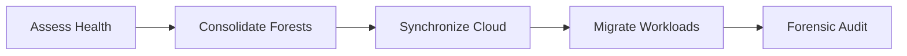

### 3. Hybrid Identity Topology
Connecting disparate on-premises AD forests strategically to Entra ID (Azure AD) via Connect or Cloud Sync agents, providing a unified institutional entry point for all organizational identities.

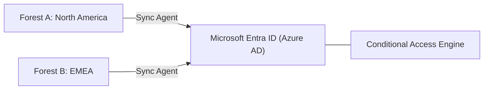

### 4. Legacy Forest Consolidation & Trust Flow
Merging disparate and aging forests into a streamlined, high-security enterprise model, reducing the institutional attack surface and simplifying the trust topology.

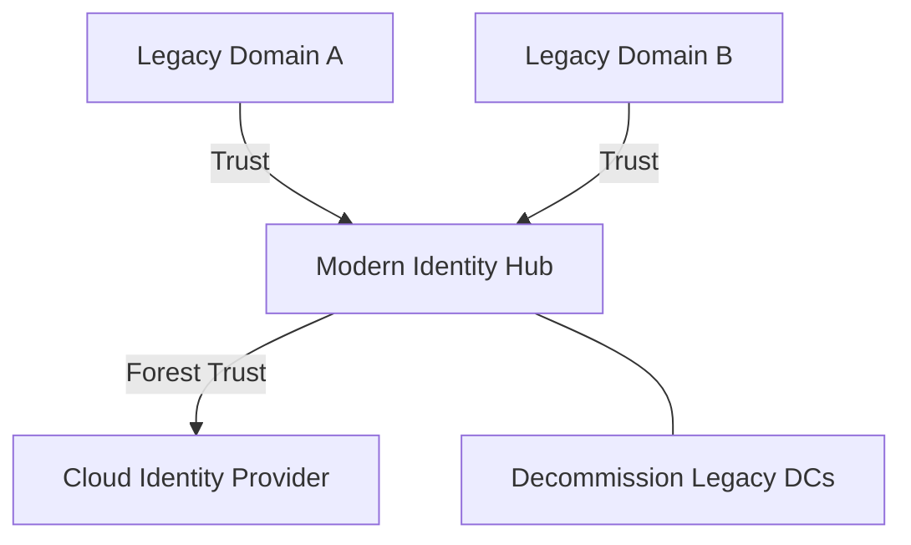

### 5. Distributed Domain Controller Modernization Flow
Managing the sequential upgrade and decommissioning of legacy Domain Controllers (Windows 2008/2012) safely across global sites, ensuring zero-interruption identity availability.

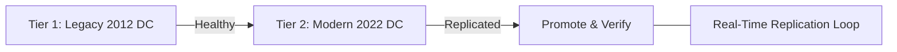

### 6. Identity Governance & Lifecycle Management Flow
Automatically orchestrating user onboarding, offboarding, and group membership updates across hybrid AD environments, eliminating "Identity Debt" and shadowed privileges.

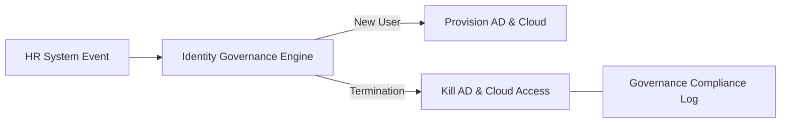

### 7. Institutional AD Maturity Scorecard
Grading organizational performance based on key indicators: AD Security Posture, Replication Health, and Cloud Sync Coverage.

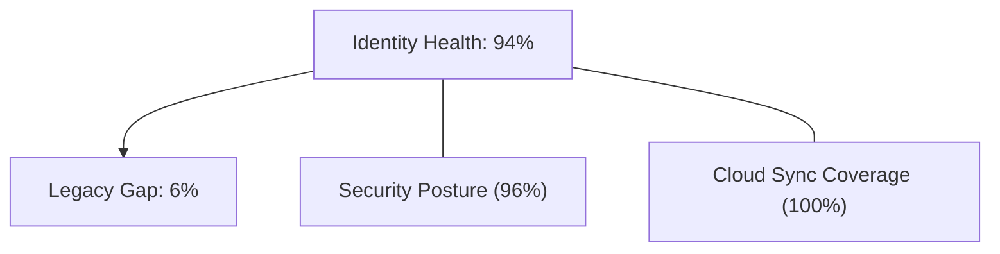

### 8. Identity & RBAC for AD Governance
Managing fine-grained access to identity schedules, modernization triggers, and audit logs between Domain Admins, Cloud Architects, and Identity Officers.

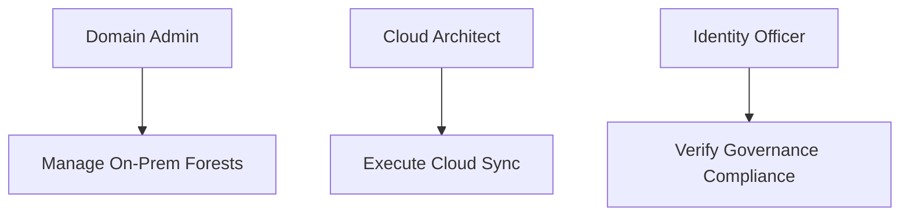

### 9. IaC Deployment: AD-Modernization-as-Code Framework
Using modular Terraform to deploy and manage the versioned distribution of the identity tracking hubs, synchronization workers, and forensic metadata lakes.

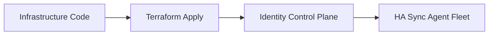

### 10. AIOps Identity Anomaly & Attack Validation Flow
Using advanced analytics to identify DCSync attacks, Golden Ticket usage, or unusual account behavior that could result in institutional identity compromise.

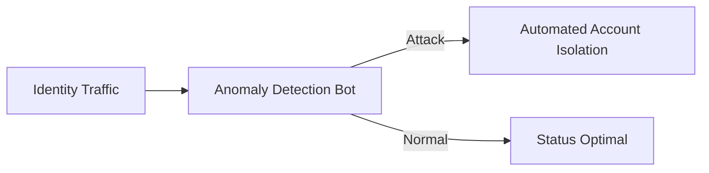

### 11. Metadata Lake for Forensic Identity Audit
Storing long-term records of every GPO change, every group membership update, and every sync event for institutional record-keeping, compliance auditing, and post-incident forensics.

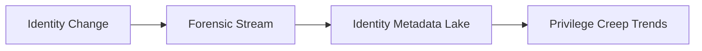

---

## 🏛️ Core Identity Pillars

1.  **Unified Identity Coordination**: Maximizing resilience by centralizing all forest identities through a single institutional plane.
2.  **Automated Health Validation**: Eliminating "fragile forest" scenarios through proactive health and trust verification.
3.  **Sequential DC Modernization**: Ensuring zero-interruption service through dependency-aware domain controller upgrades.
4.  **Zero-Trust Identity Protection**: Automatically enforcing conditional access and protocol hardening across hybrid environments.
5.  **Autonomous Governance Logic**: Guaranteeing identity integrity through automated user lifecycle runbooks.
6.  **Full Identity Auditability**: Immutable recording of every GPO change and sync event for institutional forensics.

---

## 🛠️ Technical Stack & Implementation

### Identity Engine & APIs
*   **Framework**: Python 3.11+ / FastAPI.
*   **Identity Connector**: Integration with LDAP3, Entra ID (Graph API), and PowerShell-based AD modules.
*   **Orchestrator**: Custom Python-based logic for forest consolidation and DC upgrade sequencing.
*   **Persistence**: PostgreSQL (Identity Ledger) and Redis (Live Sync State).
*   **Auth Orchestrator**: Federated OIDC/SAML for least-privilege identity management access.

### Transformation Dashboard (UI)
*   **Framework**: React 18 / Vite.
*   **Theme**: Dark, Blue, Slate (Modern high-fidelity identity aesthetic).
*   **Visualization**: D3.js for forest trust maps and Recharts for identity health analytics.

### Infrastructure & DevOps
*   **Runtime**: AWS EKS or Azure Kubernetes Service (AKS) for management plane.
*   **Sync Hub**: Managed Entra ID Connect or Cloud Sync agents.
*   **IaC**: Modular Terraform for deploying the identity landing zone and sync distributions.

---

## 🏗️ IaC Mapping (Module Structure)

| Module | Purpose | Real Services |
| :--- | :--- | :--- |
| **`infrastructure/id_hub`** | Central management plane | EKS, PostgreSQL, Redis |
| **`infrastructure/connectors`** | On-Prem & Cloud API adapters | LDAP3, Graph API, VPN |
| **`infrastructure/workers`** | DC Upgrade & Cleanup fleet | K8s Workers, SSH, WinRM |
| **`infrastructure/auditing`** | Forensic identity sinks | S3, Athena, Quicksight |

---

## 🚀 Deployment Guide

### Local Principal Environment
```bash
# Clone the identity platform
git clone https://github.com/devopstrio/legacy-ad-modernisation.git
cd legacy-ad-modernisation

# Configure environment
cp .env.example .env

# Launch the Identity stack
make init

# Trigger a mock forest discovery and protocol hardening simulation
make simulate-identity
```

Access the Transformation Hub at `http://localhost:3000`.

---

## 📜 License
Distributed under the MIT License. See `LICENSE` for more information.

---
<div align="center">
  <p>© 2026 Devopstrio. All rights reserved.</p>
</div>
