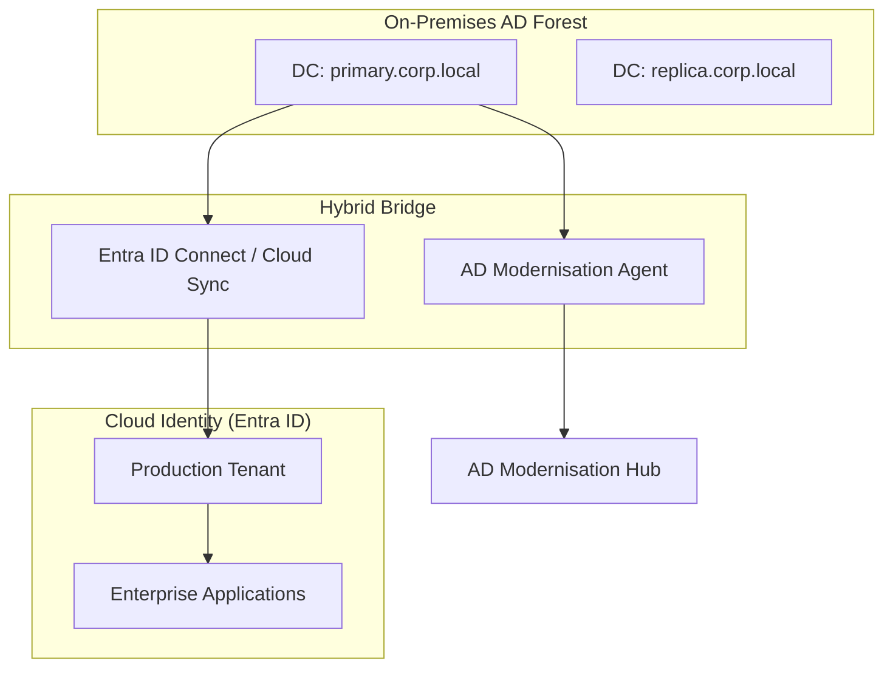
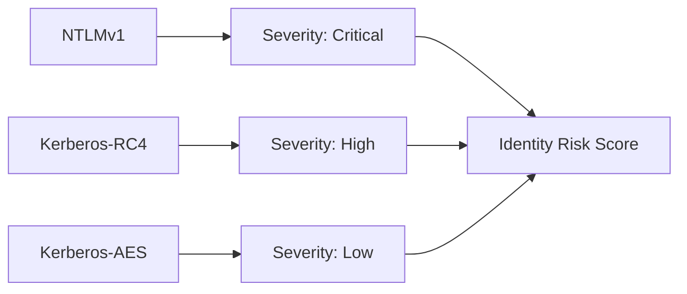
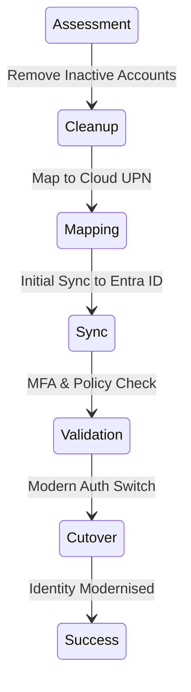

# Architecture & Transformation Diagrams

## 11. Hybrid Identity Topology (Detailed)
*How the platform orchestrates identity between On-Prem AD and Entra ID.*

## 13. "Protocol Risk" Heatmap Model

## 20. Migration Runbook Execution Flow

