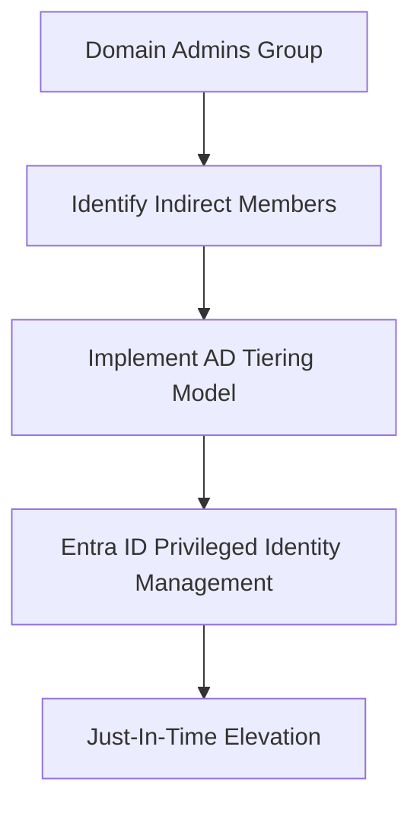
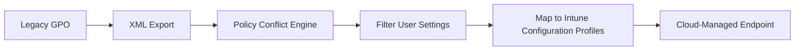
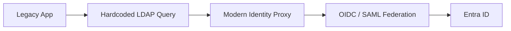

# Security & Risk Diagrams

## 31. Privileged Access Modernisation (PAM)

```mermaid
graph TD
    Legacy[Domain Admins Group] --> Detect[Identify Indirect Members]
    Detect --> Tiering[Implement AD Tiering Model]
    Tiering --> PIM[Entra ID Privileged Identity Management]
    PIM --> JIT[Just-In-Time Elevation]
```

## 34. GPO Modernisation Pipeline

```mermaid
graph LR
    GPO[Legacy GPO] --> Export[XML Export]
    Export --> Analyze[Policy Conflict Engine]
    Analyze --> Filter[Filter User Settings]
    Filter --> CSP[Map to Intune Configuration Profiles]
    CSP --> Modern[Cloud-Managed Endpoint]
```

## 40. "LDAP to OIDC" Migration Pattern

```mermaid
graph LR
    App[Legacy App] --> LDAP[Hardcoded LDAP Query]
    LDAP --> Proxy[Modern Identity Proxy]
    Proxy --> OIDC[OIDC / SAML Federation]
    OIDC --> Entra[Entra ID]
```
